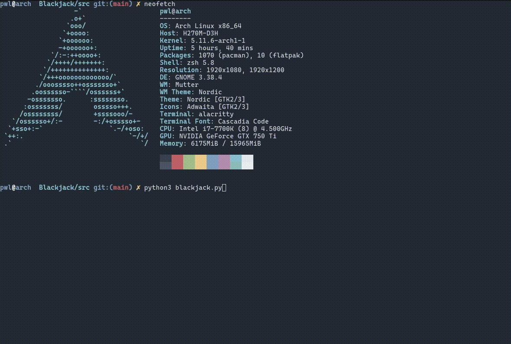

# Cursed Blackjack
This is a simple, stripped down version of blackjack game in CLI. Made possible by the [curses library](https://docs.python.org/3/library/curses.html). It also utilizes [random.org](https://www.random.org/) API to shuffle cards.

## Goals of this project
The fundamental goal of this project is to practice basic Python skills, including OOP.

Making the best blackjack game possible is **NOT** a goal of this project. I want to implement just the basic functionality.

# How it works
If you're not familiar with Blackjack rules, you can find them [here](https://en.wikipedia.org/wiki/Blackjack). I decided not to include card splitting nor doubling down due to lack of time. A player can only hit or stand. Dealer must stand on 17 (soft 17 included) and must draw to 16.

# Presentation

# Missing features
If you want to build upon this project here are things that are missing from functionality:
- [x] Hitting
- [x] Standing
- [ ] Doubling down
- [ ] Splitting
- [ ] Side bets